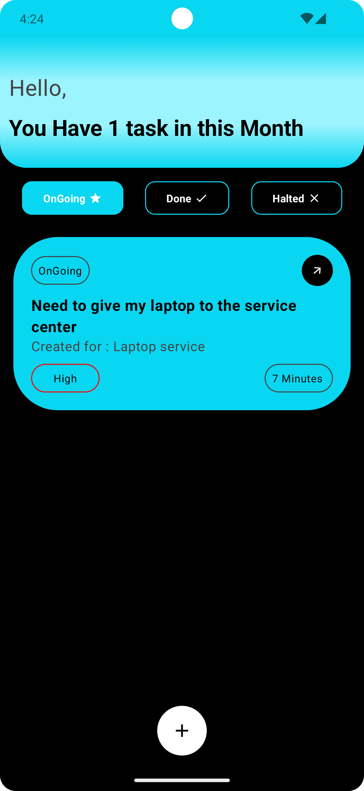
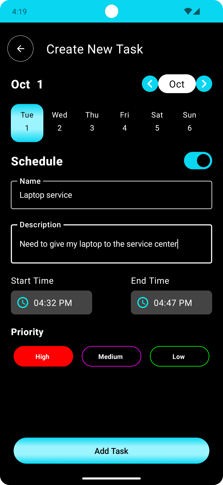
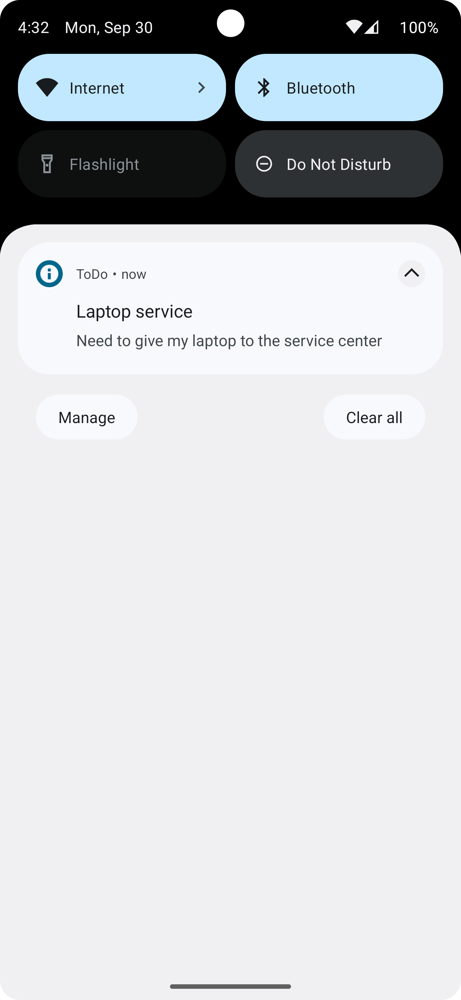

# TaskManagement Android App

A simple and efficient TaskManagement application built with Jetpack Compose.
This app allows users to manage their tasks by creating, updating, deleting, and scheduling them to
show notifications.

## Features

- **View Tasks**: Display a list of tasks categorized by status.
- **Create New Task**: Add new tasks with details such as name, description, and time.
- **Update Tasks**: Edit existing tasks.
- **Delete Tasks**: Remove tasks from the list.
- **Task Scheduling**: Set reminders and schedule notifications for tasks.

## MVVM Architecture

This app follows the **Model-View-ViewModel (MVVM)** architecture pattern to ensure separation of
concerns and facilitate testability:

- **Model**: Responsible for handling data (Room database) and business logic.
- **View**: The Jetpack Compose UI, which observes data and reacts to changes.
- **ViewModel**: Manages the communication between the View and Model, and provides observable data
  to the View.

## Screenshots

| Main Screen                          | Task Creation                             | Notifications                           |
|--------------------------------------|-------------------------------------------|-----------------------------------------|
|  |  |  |

## Build with

- **Jetpack Compose**: Used for building declarative UI.
- **Room**: Local database for persisting tasks.
- **Dagger Hilt**: Dependency injection framework.
- **Coroutines**: Asynchronous programming to handle background tasks.
- **Flow**: Handle data streams and state management.
- **WorkManager**: Schedule tasks for showing notifications.

### Testing

- **JUnit**: Framework for unit testing.
- **Mockito**: Used for mocking objects during tests.
- **Coroutines Test**: Testing coroutine-based code.

## Developed By

Gowtham A

## License

```plaintext
MIT License

Copyright (c) 2024 GOWTHAM ASHOK

Permission is hereby granted, free of charge, to any person obtaining a copy
of this software and associated documentation files (the "Software"), to deal
in the Software without restriction, including without limitation the rights
to use, copy, modify, merge, publish, distribute, sublicense, and/or sell
copies of the Software, and to permit persons to whom the Software is
furnished to do so, subject to the following conditions:

The above copyright notice and this permission notice shall be included in all
copies or substantial portions of the Software.

THE SOFTWARE IS PROVIDED "AS IS", WITHOUT WARRANTY OF ANY KIND, EXPRESS OR
IMPLIED, INCLUDING BUT NOT LIMITED TO THE WARRANTIES OF MERCHANTABILITY,
FITNESS FOR A PARTICULAR PURPOSE AND NONINFRINGEMENT. IN NO EVENT SHALL THE
AUTHORS OR COPYRIGHT HOLDERS BE LIABLE FOR ANY CLAIM, DAMAGES OR OTHER
LIABILITY, WHETHER IN AN ACTION OF CONTRACT, TORT OR OTHERWISE, ARISING FROM,
OUT OF OR IN CONNECTION WITH THE SOFTWARE OR THE USE OR OTHER DEALINGS IN THE
SOFTWARE.
